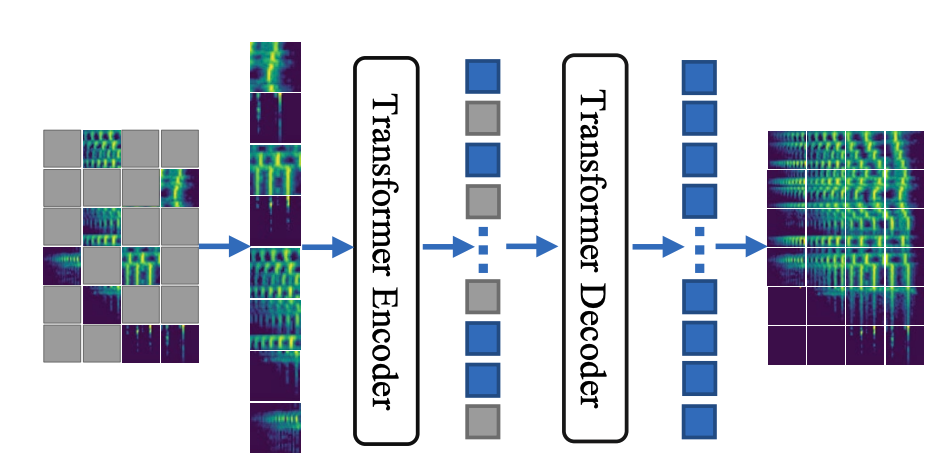
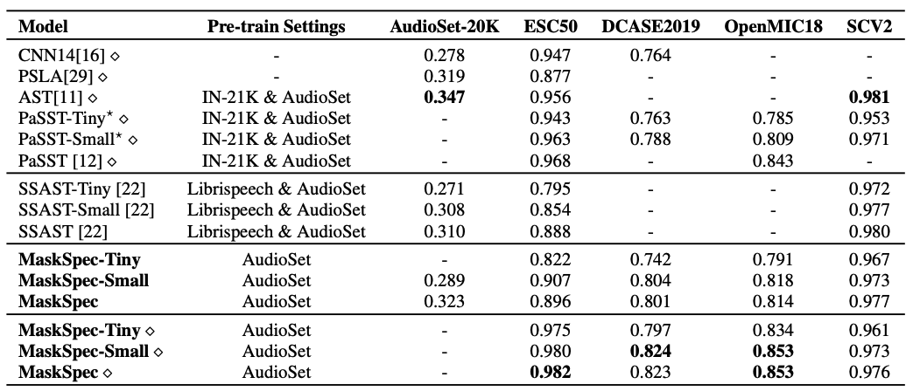

# MaskSpec

This is the Pytorch implementation of paper: [Masked Spectrogram Prediction For Self-Supervised Audio Pre-Training](https://arxiv.org/pdf/2204.12768.pdf).

In this paper, we present a novel self-supervised learning method for transformer-based audio models, called masked spectrogram prediction (MaskSpec), to learn powerful audio representations from unlabeled audio data (AudioSet used in this paper). Our method masks random patches
of the input spectrogram and reconstructs the masked regions with an encoder-decoder architecture. Without using extra model weights or supervision, experimental results on multiple downstream datasets demonstrate MaskSpec achieves a significant performance gain against the supervised methods and
outperforms the previous pre-trained models. 
In particular, our best model reaches the performance of 0.471 (mAP) on AudioSet, 0.854 (mAP) on OpenMIC2018, 0.982 (accuracy) on ESC-50, 0.976 (accuracy) on SCV2, and 0.823 (accuracy) on DCASE2019 Task1A respectively.



Continuously Updating :)

# Setting up the experiments environment

Our experiments are based on `cuda 11.5` and `python 3.7.10`:

```
conda create -n audiotrans python=3.7.10
conda activate audiotrans
pip install torch==1.8.1+cu111 torchvision==0.9.1+cu111 torchaudio==0.8.1 -f https://download.pytorch.org/whl/torch_stable.html
pip install -r requirements.txt
```

# Settings

- Change ```base_dir``` in ```audioset/dataset.py``` to your own path.
- Change ```hdf5_file``` in ```audioset/get_mean_std.py``` to your own, which is the unbalanced training data of Audioset now.
- Run ```python audioset/get_mean_std.py``` to get the mean and std values in random 10000 samples, and you will get a file named ```mean_std_128.npy``` in your working dir.

# Test scripts
We provide a simple script to extract the embeddings and get the results of audio tagging. Our trained model (mAP of 0.471 on AudioSet) can be found [Google Drive page](https://drive.google.com/file/d/1TwP9JMq6EViaSXAhpNMuQW56RIbk-v-v/view?usp=sharing).
Feel free to download it and use it.

```
bash scripts/test.sh
```

Test results:

```
[04:34:44.007448] Top 8 sound events: ['Cat', 'Animal', 'Domestic animals pets', 'Caterwaul', 'Meow', 'Speech', 'Music', 'Inside, small room']
[04:34:44.007499] Top 1 sound event: Cat
[04:34:44.007517] embedding: (1, 768)
```

# Train scripts

If you want to train your own MaskSpec models, we provide the following training scripts.

## Preparing Dataset

Download and prepare the dataset as explained in the [audioset page](https://github.com/kkoutini/PaSST/tree/main/audioset).

You can use the audio files provided by [PANNS](https://github.com/qiuqiangkong/audioset_tagging_cnn).

That is [https://pan.baidu.com/s/13WnzI1XDSvqXZQTS-Kqujg](https://pan.baidu.com/s/13WnzI1XDSvqXZQTS-Kqujg), password: 0vc2

## Vit Training From Scratch on Audioset

The base Vit model can be trained from scratch for example like this (using 8 GPUs):
```
bash scripts/train_from_scratch_vit.sh
```

## Vit Pretraining on Audioset

The base Vit model can be pretrained for example like this (using 8 GPUs):
```
bash scripts/pretrain_vit.sh
```

## Vit Pretraining on Other Datasets (Large scale)

The base Vit model can be pretrained for example like this (using 8 GPUs):
```
bash scripts/submitit_pretrain.sh
```

## Vit Finetuning on Audioset

The base Vit model can be fintuned for example like this (using 8 GPUs):
```
bash scripts/finetune_vit.sh
```

## Finetuning on downstream datasets 

The base Vit model can be fintuned for example like this:
```
python dcase18/convert_to_mp3.py
python dcase18/create_h5pymp3_dataset.py
python dcase18/get_mean_std.py
bash dcase18/run.sh
```

# Results




# References

1. [PaSST: Efficient Training of Audio Transformers with Patchout](https://github.com/kkoutini/PaSST)
2. [Masked Autoencoders Are Scalable Vision Learners](https://github.com/facebookresearch/mae)


## Contact
If you have any problem about our code, feel free to contact
- wanghl15@pku.edu.cn

or describe your problem in Issues.
